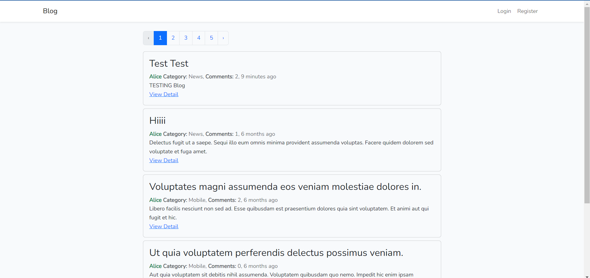

# Blog Application

This is a simple blog application built using Bootstrap for the frontend and Laravel for the backend.

## Screenshot

## Features

-   User Authentication (Login/Register)
-   Create, Read, Update, and Delete (CRUD) blog posts
-   Pagination for blog posts
-   Comments on blog posts
-   Categories for blog posts

## Technologies Used

-   **Frontend:** Bootstrap
-   **Backend:** Laravel
-   **Database:** MySQL

## Usage

-   Register or log in to the application.
-   Create, edit, or delete blog posts.
-   Comment on blog posts.
-   View blog posts by category.
